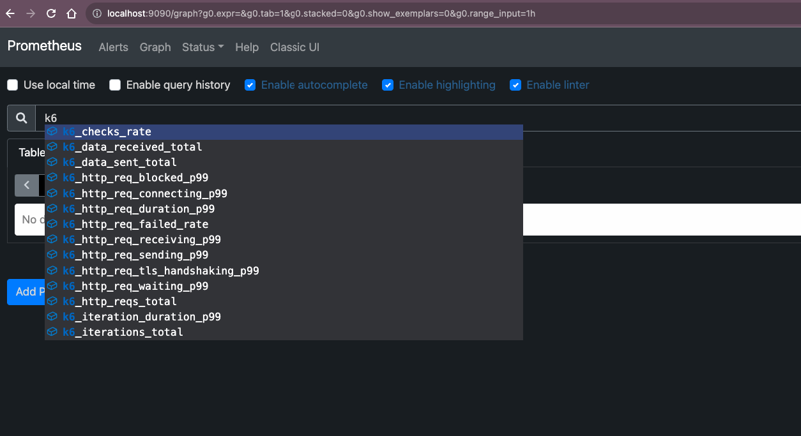
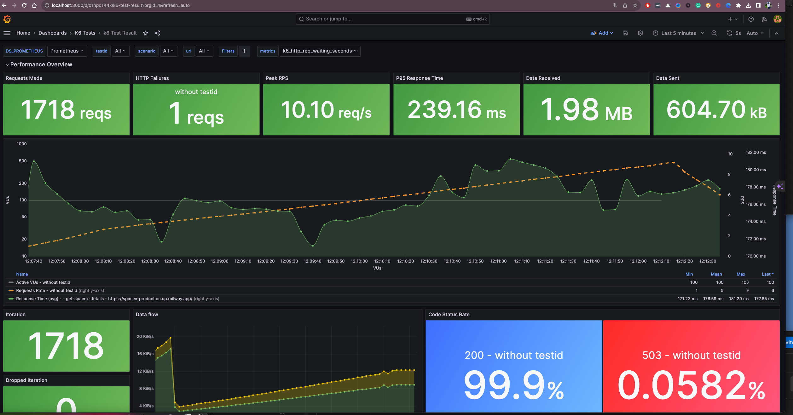
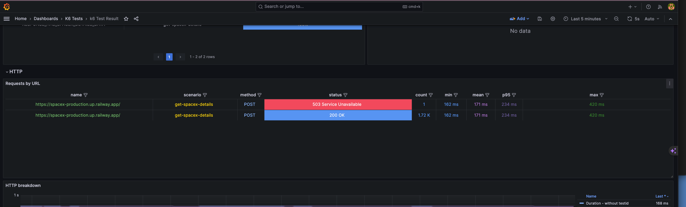
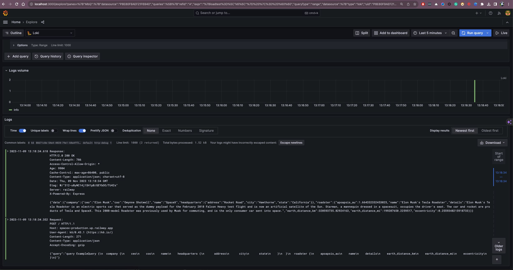

# 🎉 DemoK6LoadTesting 🎉

This repository contains performance tests to be executed by [TestKube](https://testkube.io/).  Publishing test results to [Prometheus](https://prometheus.io/) and visualizing them in [Grafana](https://grafana.com/) is supported.

## 📝 Installation

MacOS

```bash
brew install k6
```
check version
```bash
k6 version
```
Check the [releases](https://github.com/grafana/k6/releases) page for different versions of k6.

Run K6 scripts to publish metrics to Prometheus

```bash
K6_PROMETHEUS_RW_SERVER_URL=http://localhost:9090/api/v1/write \
K6_PROMETHEUS_RW_TREND_AS_NATIVE_HISTOGRAM=true \
K6_PROMETHEUS_RW_INSECURE_SKIP_TLS_VERIFY=true \
K6_PROMETHEUS_RW_STALE_MARKERS=true \
k6 run \
-o experimental-prometheus-rw \
--log-output=loki=http://localhost:3100/loki/api/v1/push,label.loadtest=k6,limit=1000,pushPeriod=1m,msgMaxSize=1231,level=trace \
tests/script.js
```

```bash
# Prometheus URL to write metrics from K6 to Prometheus
K6_PROMETHEUS_RW_SERVER_URL
```
more details [here](https://k6.io/docs/results-output/real-time/prometheus-remote-write/) how to write metrics from K6 to Prometheus

more details [here](https://k6.io/docs/using-k6/k6-options/reference/#loki) how to write logs from K6 to Loki

Run K6 browser based scripts to publish metrics to Prometheus

```bash
K6_PROMETHEUS_RW_SERVER_URL=http://localhost:9090/api/v1/write \
K6_PROMETHEUS_RW_TREND_AS_NATIVE_HISTOGRAM=true \
K6_PROMETHEUS_RW_INSECURE_SKIP_TLS_VERIFY=true \
K6_PROMETHEUS_RW_STALE_MARKERS=true \
K6_BROWSER_HEADLESS=false
k6 run \
-o experimental-prometheus-rw \
tests/browser-test.js
```
K6 browser tests documentation

https://github.com/grafana/xk6-browser

## 🔨 Running Loki, Prometheus and Grafana Locally


### Prerequisites

Before you begin, ensure you have the following installed:
- Docker
- Docker Compose

You can download Docker [here](https://docs.docker.com/get-docker/) and it includes Docker Compose in most installation packages.

### Starting the Services

   ```shell
   docker-compose up -d
   ```

This will pull the required Docker images, create volumes, and start the Prometheus and Grafana containers.

### Accessing Prometheus

Once the services are up and running, you can access the Prometheus web UI by opening your browser and going to:

```
http://localhost:9090/metrics
```


Here you can execute queries to explore your metrics and see the health of your monitoring system.

### Accessing Grafana

* Visualize your results to analyze performance during the test run or over multiple test runs.
* Correlate test results with application and system metrics in the same dashboard to get a holistic overview of your system's performance and quickly find the root causes of performance issues.

Grafana will be available by navigating to the following URL in your browser:

```
http://localhost:3000
```

By default, the login credentials are set to `admin` for the username and `admin` for the password. It's strongly recommended to change these credentials upon first login.



By default, k6 dashboard is available in Grafana. You can access it by navigating to the Grafana dashboard

Available dashboard resources:
* [k6-prometheus-native-histograms](https://grafana.com/grafana/dashboards/18030-k6-prometheus-native-histograms/)
* [k6-prometheus](https://grafana.com/grafana/dashboards/2587)

### Accessing Loki logs

Loki will be available by navigating to the Grafana under explorer section.



### Stopping the Services

To stop the services, run the following command:

```shell
docker-compose down
```

```bash
docker kill $(docker ps -q)
```

If you want to remove the volumes along with the containers, use:

```shell
docker-compose down -v
```

**Note:** This will delete your data in Prometheus and Grafana.

## 🧑‍💻 Contact

### 👷 Owner
##### 📧 Email: [beemi.raja@gmail.com]()
